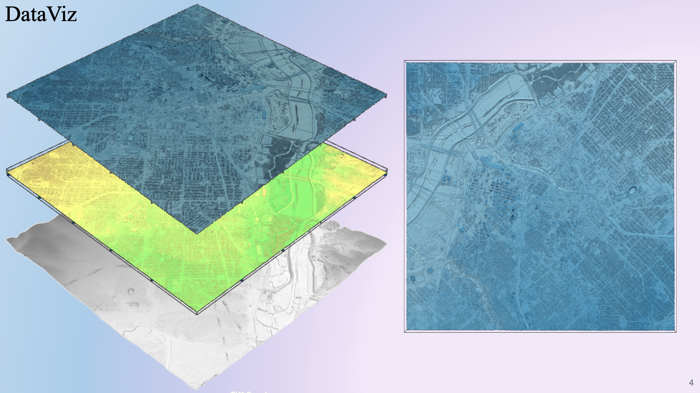

## Project
**LiDAR & 3D Visualization Practice** 🏢 🏞️ 🛰️

<table>
  <tr>
    <td valign="top">
      
    </td>
    <td valign="top">
      
    </td>
   </tr>
 </table>

## 📖 Task description
> Task and problem

Work was inspired by various `rayshader` projects in particular, and trends in 3D geodataviz in general, where `rayshader` stays for `raytracing` + `terrain shading/hillshading` (which cover both 'smart' light rendering and 'smart' terrain-relief shading above known topography). Usually people in DataViz community have been using either over-specialized tools (f.e. `blender`, `aeroid`, `3DMax`, plugins for  family of professional  `*GIS software`) or R programming language ecosystem (f.e. `rayshader`, `rayvista`, R-lang APIs) for these purposes. This project is trying to accelerate more-python-based pipeline.

Target goal of a project was to catalyze `OSM datasets` (_polygons and their feature-attributes_) acquired over the [Downtowns, Parks, Parkings](#link) project with `3D rendered plots` (_meshes above Digital Surface Models_) to color selected assets across dozens of urban areas in a fancy way in automated manner. However, I've met some restrictions still working under trying to match datasets (LiDARs with OSM; different LiDARs) and scale the pipeline (many different datasets sources; computational complex scripts). The major restriction was caused by a limited availability of high quality (~1m/<3ft) and time-actual (>2019) point cloud open datasets. The minor restrictions were caused by complexity of high-level packages themself.

> Secondary sources

* ["Penn MUSA Masterclass: 3D Mapping and Visualization with R and Rayshader" by Tyler Morgan-Wall (@tylermorganwall)](https://github.com/tylermorganwall/MusaMasterclass)
* ["Python Libraries for Mesh, Point Cloud, and Data Visualization (Part 1)" by Ivan Nikolov](https://towardsdatascience.com/python-libraries-for-mesh-and-point-cloud-visualization-part-1-daa2af36de30)
* ["Atlas of oblique maps: A collection of landform portrayals of selected areas of the world" by USGS, 1988](https://pubs.er.usgs.gov/publication/i1799)
* USGS viewers [f.e. [USGS / Entwine](https://usgs.entwine.io/) - (Potree) (Cesium)]
* Maxar \[[Precision3D Data Suite](https://www.maxar.com/products/precision3d-data-suite) | [The Globe in 3D](https://resources.maxar.com/precision3d-data-suite/the-globe-in-3d)\] and Airbus \[[Airbus Constellation](https://www.intelligence-airbusds.com/imagery/constellation/pleiades/)\]
  * [Satellite surveillance may be less of a privacy concern than you think - for now](https://www.cnet.com/science/turns-out-satellite-surveillance-only-sounds-like-a-major-privacy-concern/)
* Additional
  * [""#30DayMapChallenge" project](https://twitter.com/search?q=%2330DayMapChallenge)
  * ["Topography - 3D Rendered" by longitude.one](https://www.longitude.one/)
  * ["Shaded maps (3D, LiDAR, Terrain Shading)"" by Visual Wall Maps](https://visualwallmaps.com/)
  * [3D printed maps / tactile maps](https://www.reddit.com/r/3Dprinting/comments/l0nnsa/printed_a_7_mile2_section_of_chicago_using_lidar/) and [Touch-Mapper](https://touch-mapper.org/en/)
  * ["Making Mountains - Manufacturing: 3D Printing + Bronze Casting" by Greg Kamradt](https://www.gregkamradt.com/gregkamradt/2020/2/29/manufacturing-3d-printing-bronze-casting)
  * Secondary sources from ["Downtowns_Parks_Parkings" project](https://github.com/Witold1/downtowns_parks_parkings)

<details>
  <summary><i>Pipeline scheme</i> - click to view draft</summary>
  <table>
   <tr>
      <td>
      Data flow (logic)
      </td>
   </tr>
   <tr>
      <td>
      
      </td>
   </tr>
   <tr>
      <td>
      Preprocessing logic
      </td>
   </tr>
   <tr>
      <td>
      
      </td>
   </tr>
</table>
</details>

Current raw report available, see [[html]](https://htmlpreview.github.io/?https://github.com/Witold1/urban_lidar_3d_practice/blob/master/reports/Pipeline_and_results_final.html) | [[ipynb]](https://nbviewer.org/github/Witold1/urban_lidar_3d_practice/blob/master/notebooks/Pipeline_and_results_final.ipynb)

## 📊 Selected charts
Selected charts are provided in high quality (>4K). See below.
<details>
  <summary><i>Charts</i> - click to expand</summary>
  <table>
    <tr>
      <td>isometric</td>
      <td>orthographic</td>
    </tr>
    <tr>
      <td>
        
      </td>
      <td>
        
      </td>
    </tr>
      <td colspan=2>↑ <b>Miami Beach, FL.</b> <br><i>Data comes from State of Florida Division of Emergency Management LiDAR Project, 2007. 1ft aerial LiDAR. Tiled Lidar point cloud. <br> <a href="http://dpanther2.ad.fiu.edu/Lidar/lidarNew.php">[Dataset Link]</a> | <a href="https://earth.google.com/web/@25.76844988,-80.1382882,-1.03074489a,2196.79419071d,35y,-21.41258649h,57.16088617t,0r">[Satellite View]</a></td>
    <tr>
      <td>isometric</td>
      <td>orthographic</td>
    </tr>
    </tr>
    <tr>
      <td>
        
      </td>
      <td>
        
      </td>
    </tr>
      <td colspan=2>↑ <b>Dallas, TX.</b> <br><i>Data comes from USGS 2019 (Texas Pecos Dallas). Retrived via Texas Natural Resources Information System. 70cm aerial LiDAR. Tiled Compressed Lidar Point Cloud. <br> <a href="https://tnris.org/stratmap/elevation-lidar/">[Dataset Link]</a> | <a href="https://earth.google.com/web/@32.78039546,-96.80253943,130.18466209a,6552.38744079d,35y,99.34981803h,50.83566678t,0r">[Satellite View]</a></td>
    <tr>
        <td>isometric</td>
        <td>orthographic</td>
    </tr>
    <tr>
        <td>
          
        </td>
        <td>
          
        </td>
    </tr>
      <td colspan=2>↑ <b>Bishkek city, Kyrgyzstan.</b> <br><i>Data comes from Pleiades satellites tristereo optical imagery, 2013 (retrived via OpenTopography). 0.5m satellite remote sensing photogrammetry point cloud. <br> <a href="https://portal.opentopography.org/dataspace/dataset?opentopoID=OTDS.092021.32643.1">[Dataset Link]</a> | <a href="https://earth.google.com/web/@42.88166028,74.59693291,741.7657282a,6537.5671275d,35y,172.59410643h,43.442684t,360r">[Satellite View]</a></td>
   </table>
</details>

## 📁 Structure of repository
```
Project structure:
+--data                       <- folder for datasets
¦  L--raw                       <- ... 1. raw data
¦  L--interim                   <- ... 2. auxiliary, generated, temporary, preprocessed data
¦  L--processed                 <- ... 3. final, ready-to-analysis data
¦  L--external                  <- ... +. additional datasets
¦  
+--notebooks                  <- folder for *.ipynb files
¦  L--*.ipynb 1                 <- ... file 1
¦
+--src                        <- folder for .py scripts
¦  L--*.py 1                    <- ... file 1
¦  L--*.py 2                    <- ... file 2
¦  L--*.py 3                    <- ... file 3
¦
+--figures                    <- folder for charts and images to reports
¦  L--external                  <- ... 1. external images
¦  L--internal                  <- ... 2. internal images
¦
+--reports                    <- folder for reports (i.e. *.pptx, *.html, *.ipynb)
¦
+--docs                       <- folder for documentation files
¦
+--README.md                  <- the top-level README for developers using this project
```
[Cookiecutter Data Science](https://drivendata.github.io/cookiecutter-data-science/#directory-structure)

## 🧰  Installation
1. Check the `requirements.txt`
2. Check `wget` and `unzip` (or OS analogues)
3. Check backend for `whitebox tools` (whitebox geo)
```
a. https://www.whiteboxgeo.com/manual/wbt_book/install.html
b. https://giswqs.github.io/whitebox-frontends/#python
```
4. Check backend for `pyvista` (VTK)
```
a. https://docs.pyvista.org/getting-started/installation.html
```
5. If needed, check backend for `rasterio` (GDAL)
```
https://rasterio.readthedocs.io/en/latest/installation.html
```

## 📌 Links
> Placeholder
<!--- * Feature engineering. Preprocessing. Charts [Here](https://nbviewer.org/) --->

## 🐉 License and legals
Ask before use.
